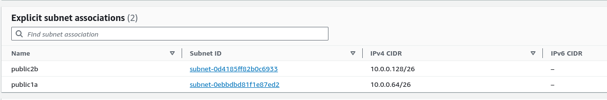
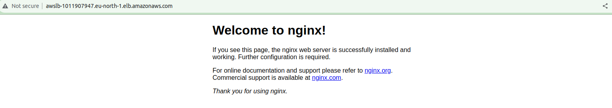
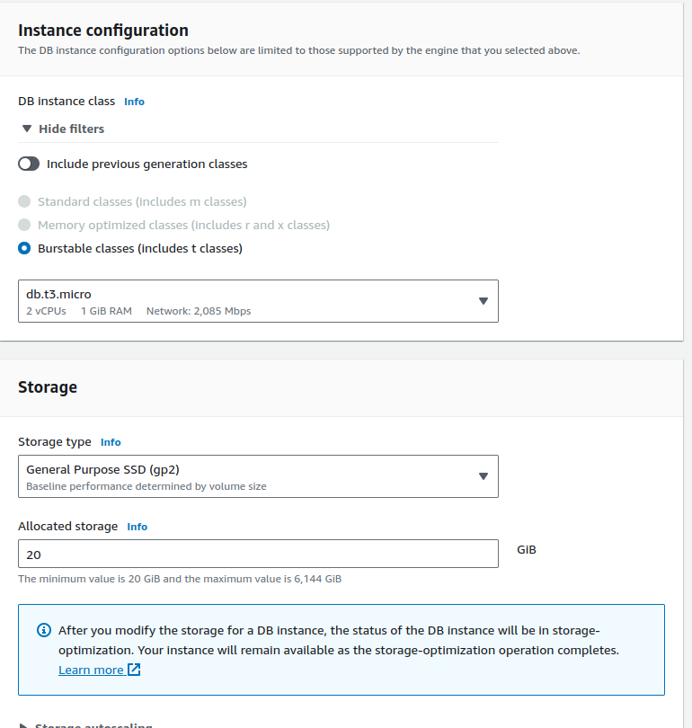
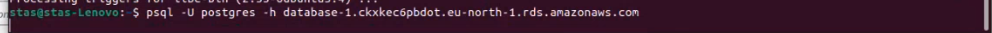

# 1) Создаем сеть в сервисе vpc


## Заходим в сабнетс и создаем три подсети.

1-ю приватную


2-ю публичную в первой зоне


3-ю публичную в второй зоне


## Ограничиваем доступ приватной сети через ACL


# 2) Создаем security group web-sg


# 3) Имеем уже сгенерерованный ключ.

# 4) Coздание 2-х публичных инстансов в разных сетях и учтановка nginx.

1-ый


2-ой


## Теперь создаем для публичных сетей internet gateways & route tables

Создание internet gateways


Создание route tables




## Подключаемся к публичным инстансам, устанавливаем nginx и заходим через браузер по ip адресу.


# 5) ЕLB

## Создание таргет группы


### Настраеваем Healthcheck с минимальным интервалом


### Добавляем инстансы


## Создание ELB

Выбираем Application load balancer


Выбираем нашу сеть и публичные инстансы


Создаем security group для ELB


Добавляем security group в ELB


Добавляем security group ELB в security group web-sg для получения поступа ELB  к инстансам.


Подключаемся по DNS ELB через браузер



Останавливаем один из инстансов и проверяем работоспособность


## Все работает!

# 6) RDS

## Создание RDS





## И Security group для RDS.

Прописываем порт RDS и добавляем группу web-sg


Добавляем Security group в RDS


Подключаемся к публичному инстансу с помошью команды "ssh -i "keypair.pem" ubuntu@51.20.134.229"
Ставим клиента postgres с помошью команды "sudo apt-get install postgressql-client"

Подключаемся к postgres


Проверяем возможность подключения с локальной машины
Ставим клиента postgres и подключаемся.



Подключение не удалось.

# 7) ElastiCache

## Создаем ElastiCache Redis


Ставим Редис клиент на инстанс с помошью команды "sudo apt install redis-tools"

Делаем Security group для Redis


Добавляем Новую группу в редис

Подключаемся


Попытка аналогичного подключения с локальной машины не увенчалась успехом.

## Создаем ElastiCache memcache


Создаем Security group для memcache


Добавляем нашу группу в memcache

Подключаемся


С локальной машины подключится не удалось.

# 8) CloudFront Distribution & s3

Находим сервис CloudFront в амазоне, создаем его по умолчанию с домменым именем нашего с3 баскета


## S3

При создания баскета делаем его не публичным


Cоздаем 100 файлов на локальной машине с помошью скрипта
``` 
for ((i = 1; i <= 100; i++)); do
  FILE_SIZE=$((RANDOM % 512 + 1))

  FILE_NAME="file_${i}.txt"

 
  dd if=/dev/urandom of="${FILE_NAME}" bs=1024 count="${FILE_SIZE}"

done
```
Загружаем их на нашь баскет.

Создаем правила хранения файлов

1 правило

никому не рассказывать о .....
по истечению 30 дней отправлять в ледник


2 правило

по истечению 180 дней удалять файлы из глейсера

